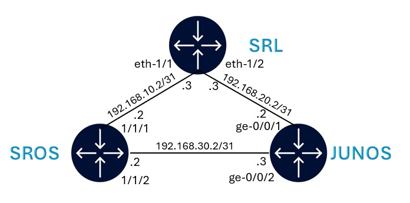

# VM-based nodes in containerlab

VM nodes integration in containerlab is based on the [hellt/vrnetlab](https://github.com/hellt/vrnetlab) project which is a fork of `vrnetlab/vrnetlab` where things were added to make it work with the container networking.

Start with cloning the project:

```bash
cd ~ && git clone https://github.com/hellt/vrnetlab.git && \
cd ~/vrnetlab
```

## Building SR OS container image

SR OS VM image is located at `~/images/sros-vm-24.7.R1.qcow2` on your VM and should be copied to the `~/vrnetlab/sros/` directory before building the container image.

```bash
cp ~/images/sros-vm-24.7.R1.qcow2 ~/vrnetlab/sros/
```

Once copied, we can enter in the `~/vrnetlab/sros` image and build the container image:

```bash
cd ~/vrnetlab/sros && make
```

The resulting image will be tagged as `vrnetlab/nokia_sros:24.7.R1`. This can be verified using `docker images` command.

```bash
REPOSITORY                    TAG       IMAGE ID       CREATED         SIZE
vrnetlab/nokia_sros           24.7.R1   553e94475c12   7 seconds ago   889MB
```

## JUNOS OS container image

Junos VM docker image is already prepared and is located at `~/images/vr-vmx.tar.gz` on your VM.

Import this image into docker.

```
docker load -i ~/images/vr-vmx.tar.gz
```

Check local docker image repo and verify that the vmx image is present.

```
docker images
```

Expected output:

```
REPOSITORY                                       TAG         IMAGE ID       CREATED         SIZE
registry.srlinux.dev/pub/vr-vmx                  bb          877650904adc   2 years ago     10.6GB
```

## Deploying the VM-based nodes lab

With the sros and junos image built, we can proceed with the lab deployment. We will deploy a lab with sros, junos and SR Linux to show that Containerlab can have a VM based docker node and a native docker node in the same lab.

Here's the topology.



First, let's switch back to the lab directory:

```bash
cd ~/cwrk/20-vm
```

Now lets deploy the lab:

```bash
sudo clab dep -c
```

At the end of the deployment, the following table will be displayed. Wait for the vmx boot to be completed (see next section), before trying to login to vmx.

```bash
╭──────────────┬────────────────────────────────────┬─────────┬─────────────────╮
│     Name     │             Kind/Image             │  State  │  IPv4/6 Address │
├──────────────┼────────────────────────────────────┼─────────┼─────────────────┤
│ clab-vm-srl  │ nokia_srlinux                      │ running │ 192.168.122.101 │
│              │ ghcr.io/nokia/srlinux:24.10.1      │         │ N/A             │
├──────────────┼────────────────────────────────────┼─────────┼─────────────────┤
│ clab-vm-sros │ nokia_sros                         │ running │ 192.168.122.102 │
│              │ vr-sros:24.7.R1                    │         │ N/A             │
├──────────────┼────────────────────────────────────┼─────────┼─────────────────┤
│ clab-vm-vmx  │ juniper_vmx                        │ running │ 192.168.122.103 │
│              │ registry.srlinux.dev/pub/vr-vmx:bb │         │ N/A             │
╰──────────────┴────────────────────────────────────┴─────────┴─────────────────╯
```

### Monitoring the boot process

To monitor the boot process of SR OS node, you can open a new terminal and run the following command:

```bash
sudo docker logs -f clab-vm-sros
```

To monitor the junox vmx boot, run:

```bash
docker logs -f clab-vm-vmx
```

Note that vmx takes around 8 mins to boot. Wait until the below line is seen in the boot logs.

```
2025-03-03 13:41:49,125: launch     INFO     Startup complete in: 0:08:31.546370
```

## Connecting to the nodes

To connect to SR OS node:

```bash
ssh clab-vm-sros
```

To connect to SR Linux node:

```bash
ssh clab-vm-srl
```

To connect to Junos node:

```bash
ssh clab-vm-vmx
```

Refer to the passwords in your sheet.

## Configuration

All 3 devices are configured with a startup configuration that will create the interfaces.

Run a ping between the interface to confirm reachability.

Login to SR Linux node and run a ping to vmx:

```srl
ping -c 3 192.168.20.2 network-instance default
```

We have now completed the section on bring VM based nodes into Containerlab.
